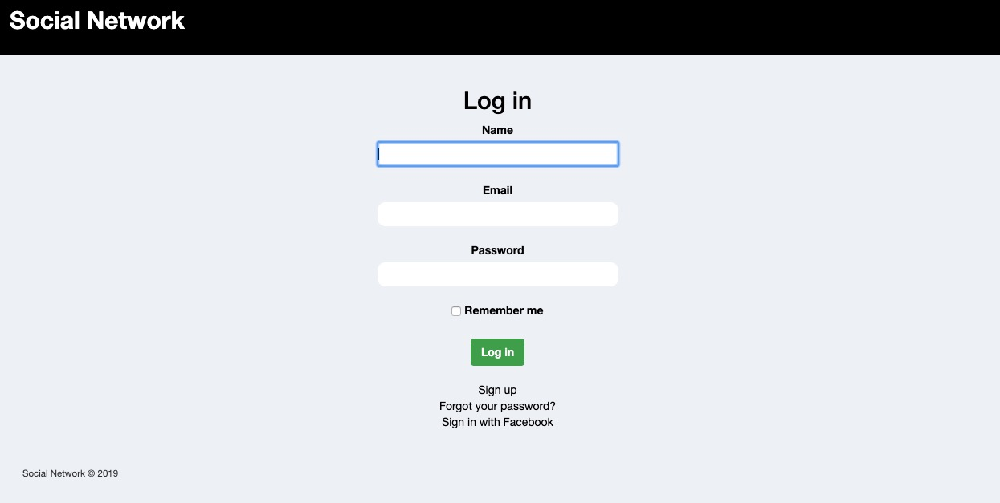

<h1 align="center">Ruby on Rails - Social Network</h1>
<p align="center">
  <a href="https://www.ruby-lang.org/en/">
    
  </a>
  <a href="http://rubyonrails.org/">
    
  </a>
</p>

<p align="center">
  
</p>

## Table of Contents
* [About](#About)
* [ERD](#ERD)
* [Built With](#build)
* [Live Version](#live)
* [Getting Started](#started)
* [Testing](#Testing)
* [Contributing](#Contributing)
* [Authors](#Authors)
* [Show Your Support](#show)
* [License](#License)

## About

This project consists of building and testing a social network web application. A large portion its core user functionality mimics that of Facebook.

## ERD


## Built With <span id="built"></span>

- Ruby on Rails
- RSpec
- PostgreSQL
- Git
- Bootstrap
- HTML5 & CSS3
- Heroku
- OAuth2

## Live Version <span id="live"></span>

[Social Network](https://frozen-hamlet-01864.herokuapp.com) 

## Getting started <span id="started"></span>
  
  To get started with the app, first clone the repo and cd into the directory:
  
  ```
  $ git clone https://github.com/AndresFMoya/ROR-Facebook_Clone.git
  $ cd RoR-Facebook_Clone
  ```
  
  Then install the needed gems (while skipping any gems needed only in production):
  
  ```
  $ bundle install --without production
  ```
  
  Next, migrate the database:
  
  ```
  $ rails db:migrate
  ```
  
  Run the app in a local server:
  
  ```
  $ rails server
  ```

## Testing

To test the application, cd into the project directory and run the following command in the terminal:
  ```
  $ bundle execute rspec
  ```

## 🤝 Contributing

Contributions, issues and feature requests are welcome! Feel free to check [issues page](https://github.com/AndresFMoya/react-rails_event_scheduler/issues).

1. Fork it (https://github.com/AndresFMoya/RoR-Facebook_Clone/develop/fork)
2. Create your working branch (git checkout -b [choose-a-name])
3. Commit your changes (git commit -am 'what this commit will fix/add/improve')
4. Push to the branch (git push origin [chosen-name])
5. Create a new pull request

## Authors
:bust_in_silhouette: Kerron King

* Github: [@KerronKing](https://github.com/KerronKing)
* Email: kerronk1989@gmail.com
* Linkedin: [Kerron King](linkedin.com/in/kerron-shawn-king)

:bust_in_silhouette: Andrés F. Moya

* Github: [Andrés F. Moya](https://github.com/AndresFMoya)

## Show your support <span id="show"></span>

Give a ⭐️ if you like this project!

## License

This project is [MIT](https://github.com/AndresFMoya/RoR-Facebook_Clone/blob/develop/LICENSE) licensed.


